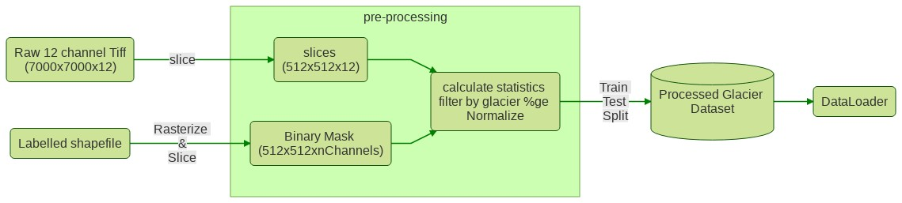

# Glacier Mapping From Satellite Imagery

## Overview
The goal of this project is to use computer vision to automatically segment debris and ice glaciers from satellite images

#### Requirements
🐍 Python3.6
* addict==2.2.1
* Cython==0.29.15
* GDAL==2.1.3
* joblib==0.14.1
* numpy==1.18.1
* pandas==0.25.3
* Pillow-SIMD==7.0.0.post3
* python-dateutil==2.8.1
* pytz==2019.3
* PyYAML==5.3
* six==1.14.0
* torch==1.4.0
* torchvision==0.5.0

### Data Description
Raw training data are 7000x7000px 12 channel sentinel-2 tiff images from the Hindu-Kush-Himalayan region. We consider the region of Bhutan and Nepal. Shapefile labels of the glaciers are provided by [ICIMOD](www.icimod.org) 


## Pipeline

### Overview

The full preprocessing and training can be done using `run_minimal.sh`. Besides
the raw tiffs and shapefiles, the required inputs are,

* environmental variables specified in `.env`
* `conf/masking_paths.yaml`: Says how to burn shapefiles into image masks.
* `conf/postprocess.yaml`: Says how to filter and transform sliced images.
* `conf/train.yaml`: Specifies training options.

At each step, the following intermediate files are created,
* `python3 -m src.mask` --> writes mask_{id}.npy's and mask_metadata.csv
* `python3 -m src.slice` --> writes slice_{tiff_id}_img_{slice_id}, slice_{tiff_id}_label_{slice_id}, and slice_0-100.geojson (depending on which lines from mask_metadata are sliced)
* `python3 -m src.process_slices` --> copies slices*npy from previous step into train/, dev/, test/ folders, and writes mean and standard deviations to path specified in postprocess.yaml
* `python3 -m src.train` --> creates data/runs/run_name folder, containing logs/ with tensorboard logs and models/ with all checkpoints


### Data Preprocessing:

1. **Slicing**: We slice the 7000x7000 input tiffs into 512x512 tiles. The resulting tiles along with corresponding shapefile labels are stored. Metadata of the slices are stored in a geojson file" ```slicemetadata.geojson```
    To slice, ```run: python3 src/slice.py```
2. **Transformation**: For easy processing, we convert the input image and labels into multi-dimensional numpy ``.npy`` files.
3. **Masking**: The input shapefiles are transformed into masks. The masks are needed for use as labels. This involves transforming the label as multi-channel images with each channel representing a label class ie. 0 - Glacier, 1 debris etc
    To run transformation and masking: ```python3 src/mask.py```

### Data PostProcessing
1. **Filtering**: Returns the paths for pairs passing the filter criteria for a specific channel. Here we filter by the percentage of 1's in the filter channel.
2. **Random Split**: The final dataset is saved in three folders: ``train/ test/ dev/``
3. **Reshuffle**: Shuffle the images and masks in the output directory
4. **Generate stats**: Generate statistics of the input image channels: returns a dictionary with keys for means and standard deviations accross the channels in input images.
5. **Normalization**: We normalize the final dataset based on the means and standard deviations calclualted.
6. **Imputation**: Given and input, we check for missing values (NaNs) and replace with 0

    To Run all PostProcessing: 
    ```
    python3 -m src.post_process.py
    --slice_dir=/path_to_glacier_slices/
    --slice_meta=/path_to_slice_metadata.geojson
    
    ```
 


### Model Training
Model: Unet
To train:
```python3 train.py```

---

## vector data sources
Labels : [ICIMOD](http://www.icimod.org/)

* [(2000, Nepal)](http://rds.icimod.org/Home/DataDetail?metadataId=9351&searchlist=True): Polygons older/newer than 2 years from 2000 are filtered out. Original collection contains few polygons from 1990s

 * [(2000, Bhutan)](http://rds.icimod.org/Home/DataDetail?metadataId=9357&searchlist=True): Used as it's

* [(2010, Nepal)](http://rds.icimod.org/Home/DataDetail?metadataId=9348&searchlist=True): Polygons older/newer than 2 years from 2010 are filtered out. Original collection is for 1980-2010

* [(2010, Bhutan)](http://rds.icimod.org/Home/DataDetail?metadataId=9358&searchlist=True): Used as it's

Borders:
* [Natural Earth: Admin-0 details](http://www.naturalearthdata.com/downloads/10m-cultural-vectors/)

Test Data: 
* Dudh Koshi sub basin (provided directly from ICIMOD)
